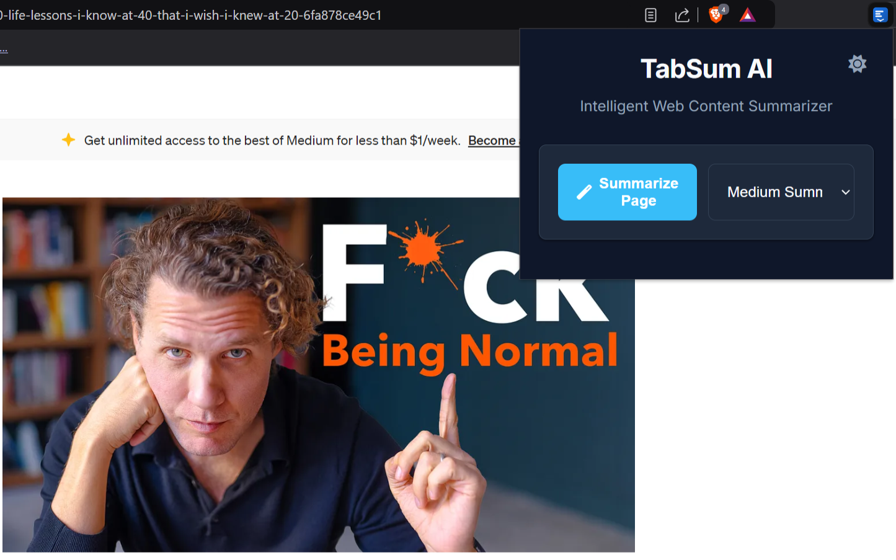
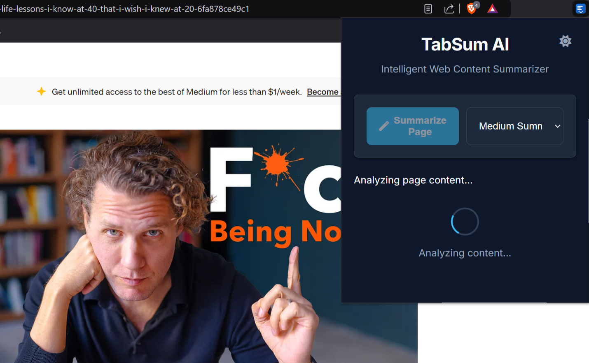
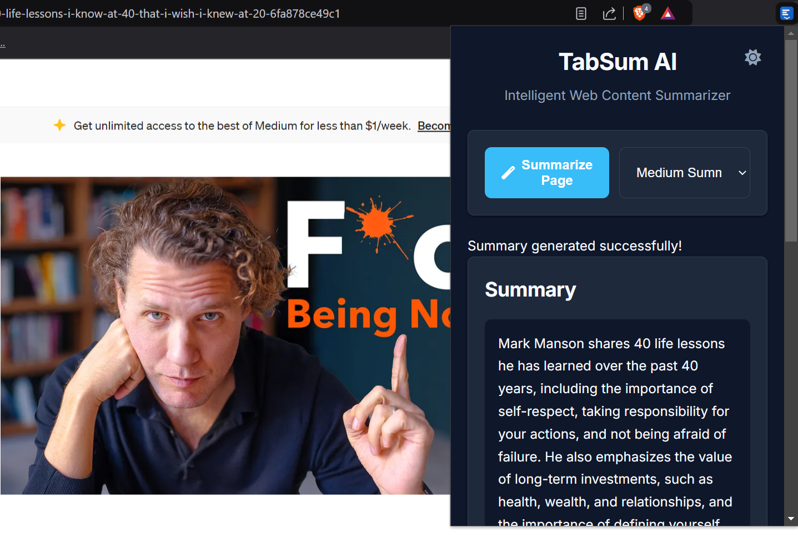
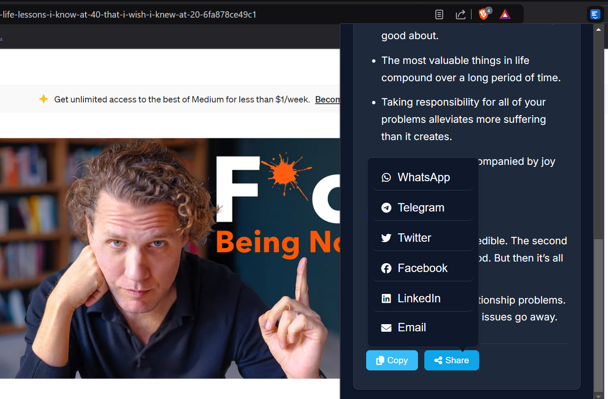

# TabSum AI - Intelligent Web Content Summarizer 🤖

[](https://chrome.google.com/webstore/detail/tabsum-ai/[your-extension-id])
[](https://github.com/MarsX-2002/tabsum-ai/stargazers)
[](https://opensource.org/licenses/MIT)
[](https://github.com/MarsX-2002/tabsum-ai/pulls)

<div align="center">


> 🚀 Transform any webpage into a concise, intelligent summary with just one click! Powered by Google's Gemini Pro AI.

</div>

TabSum AI is a powerful Chrome extension that uses artificial intelligence to generate smart summaries of web content. Perfect for researchers, students, professionals, and anyone who wants to quickly grasp the essence of any webpage.

[🎯 Install from Chrome Web Store](#) | [📖 Read Documentation](https://github.com/MarsX-2002/tabsum-ai/wiki) | [🤝 Contribute](https://github.com/MarsX-2002/tabsum-ai/blob/main/CONTRIBUTING.md)

## ✨ Key Features

- 🤖 **AI-Powered Summarization**: Generate concise, intelligent summaries using Google's Gemini Pro API
- 📊 **Multiple Summary Lengths**: Choose between short (TL;DR), medium, or detailed summaries
- 🎯 **Key Points Extraction**: Automatically identifies and highlights main takeaways
- 📱 **Easy Sharing**: Share summaries directly to:
  - WhatsApp
  - Telegram
  - Twitter
  - Facebook
  - LinkedIn
  - Email
- 🌓 **Dark/Light Theme**: Supports both dark and light modes with system preference detection
- 🎨 **Clean UI**: Modern, minimalist interface with Inter font

## 📸 Screenshots

Here's how TabSum AI looks in action:

<div align="center">


*Initial view with summary length options*


*Generated summary with key points*


*Dark mode support*


*Share options for multiple platforms*

</div>

## 🚀 Installation Guide

Since this extension is not on the Chrome Web Store, you can install it directly from GitHub:

1. **Download the Extension**
   - Click the green "Code" button above
   - Select "Download ZIP"
   - Extract the ZIP file to a folder on your computer

2. **Install in Chrome**
   - Open Chrome and go to `chrome://extensions/`
   - Enable "Developer mode" in the top right corner
   - Click "Load unpacked"
   - Select the extracted folder

3. **Configure the Extension**
   - Create a `config.js` file in the extension directory
   - Add your Gemini Pro API key:
     ```javascript
     const config = {
         apiKey: 'YOUR_GEMINI_PRO_API_KEY'
     };
     ```
   - Get your API key from [Google AI Studio](https://makersuite.google.com/app/apikey)

4. **Verify Installation**
   - Look for the TabSum AI icon in your Chrome toolbar
   - Click it to start summarizing web pages!

> Note: When installing from GitHub, Chrome may show a warning about developer mode extensions. This is normal for locally installed extensions.

## 🚀 Quick Start

### Installation

1. Visit [TabSum AI on Chrome Web Store](#)
2. Click "Add to Chrome"
3. Click the TabSum AI icon in your extensions bar
4. Start summarizing!

### For Developers

1. Clone the repository:
   ```bash
   git clone https://github.com/MarsX-2002/tabsum-ai.git
   ```
2. Create a `config.js` file with your Gemini Pro API key
3. Load in Chrome:
   - Navigate to `chrome://extensions/`
   - Enable "Developer mode"
   - Click "Load unpacked"
   - Select the project directory

## 🛠️ Technical Stack

- ⚡ Chrome Extension Manifest V3
- 🤖 Google's Generative Language API (Gemini Pro)
- 📱 Modern ES6+ JavaScript
- 🎨 CSS Variables for theming
- 🔒 Secure API key management

## 🔐 Security

- API key stored securely in separate config file
- Minimal permissions requested
- No sensitive data retention
- Secure message passing between components

## 🤝 Contributing

We love your input! Check out our [Contributing Guidelines](CONTRIBUTING.md) to get started.

## 📝 License

MIT License - See [LICENSE](LICENSE) file for details

## 🌟 Star History

[](https://star-history.com/#MarsX-2002/tabsum-ai&Date)

## 🔍 Keywords

`chrome-extension`, `ai-summarizer`, `gemini-pro`, `web-content`, `text-summarization`, `productivity-tool`, `content-analysis`, `browser-extension`, `javascript`, `ai-powered`, `web-tools`

---

<div align="center">

Made with ❤️ by [MarsX-2002](https://github.com/MarsX-2002)

[Report Bug](https://github.com/MarsX-2002/tabsum-ai/issues) · [Request Feature](https://github.com/MarsX-2002/tabsum-ai/issues) · [Star on GitHub](https://github.com/MarsX-2002/tabsum-ai)

</div>
